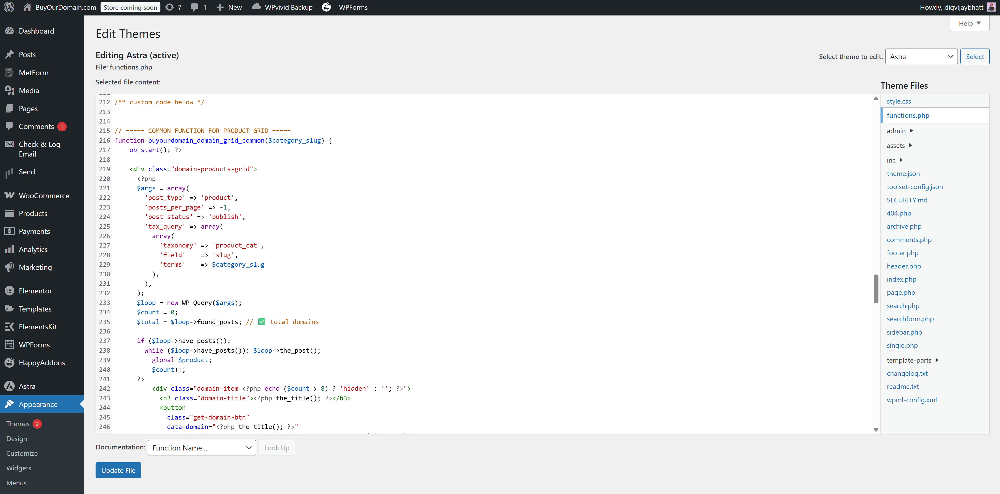
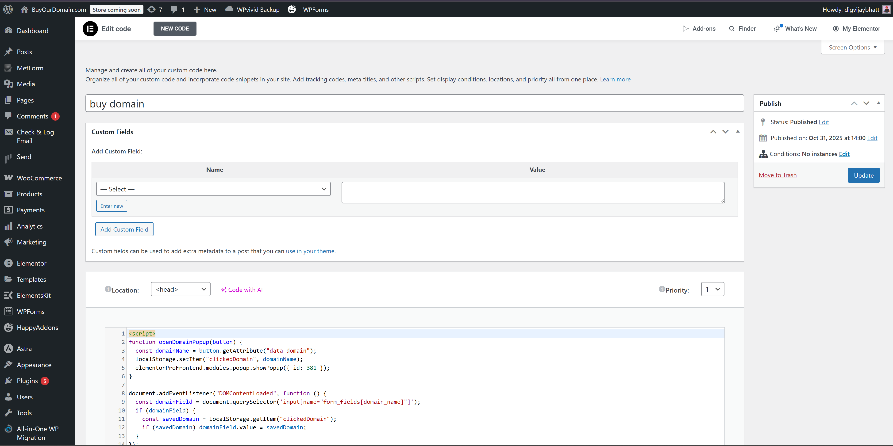
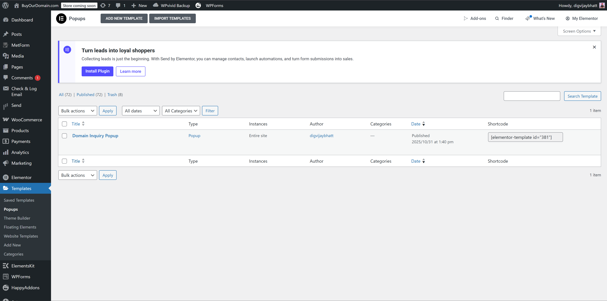
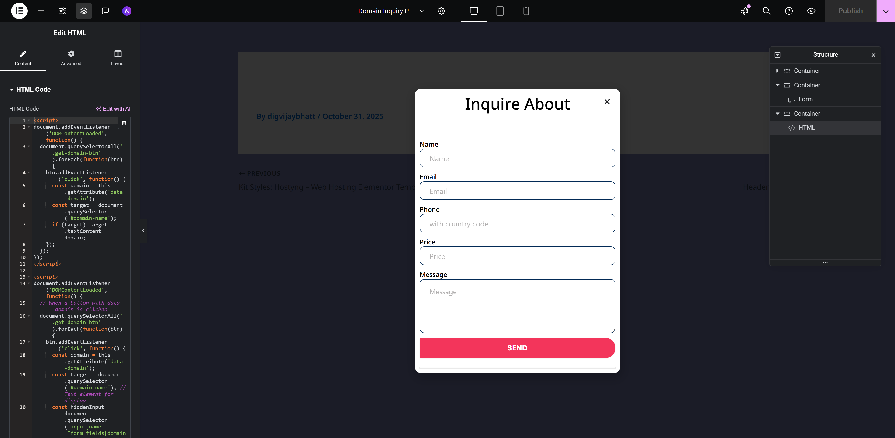
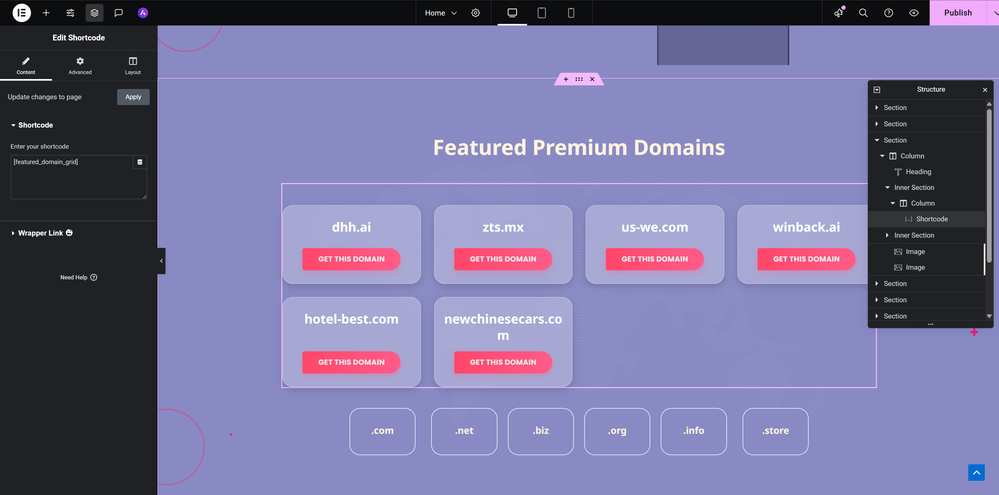
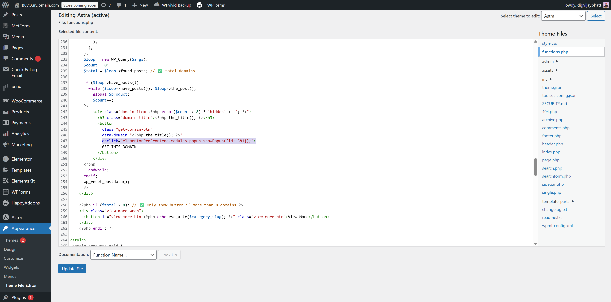
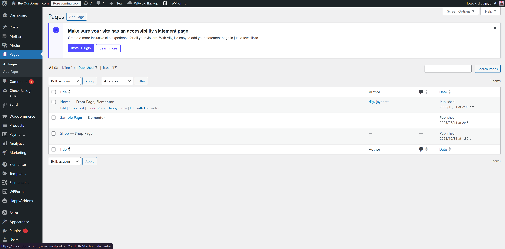

# 🛒 BuyOurDomain.com – WooCommerce + Custom Domain Grid Integration

This documentation explains how to **manage domain products**, **edit front-end features**, and **understand the custom code** used on the WordPress site [buyourdomain.com](https://buyourdomain.com/).  
It’s designed for developers, editors, or team members to easily maintain and update the website without breaking existing functionality.

---

## 📘 Project Overview

The website lists **domain names as products** and dynamically displays them on the homepage using **custom PHP shortcodes**, **Elementor integrations**, and **custom JavaScript** for popup and form interactions.

### 🧠 Core Custom Features
- Dynamic product grid display by category (`featured`, `portfolio`, etc.)
- “Get This Domain” popup trigger integrated with Elementor
- LocalStorage-based domain name auto-fill in popup form
- Hidden HTML element in popup for domain name injection
- Incremental “View More” loading of domains
- Responsive grid layout with gradient buttons and hover effects
- Automated email responses on enquiry submission (to user & admin)
  
---

## ⚙️ Table of Contents

1. [File Structure](#-file-structure)
2. [Website Structure](#-website-structure)
3. [Custom Code Locations](#-custom-code-placing-locations)
4. [Custom Code Explanation](#-custom-code-explanations)
5. [Popup Form – Where to Edit in Elementor](#-popup-form--where-to-edit-in-elementor)
6. [Form ID Integration](#-how-to-change-popup-form-ids-in-custom-code)
7. [Uploading Domain Products](#-how-to-upload-domain-products)
8. [Editing Homepage Sections](#-how-to-edit-homepage-section-in-elementor)
9. [Developer Notes](#%E2%80%8D-developer-notes)

---

## 📁 File Structure

| File | Location | Description |
|------|-----------|-------------|
| `functions.php` | `Appearance > Theme File Editor > functions.php` | Contains PHP shortcodes, grid logic, and popup trigger integration. |
| `elementor custom code (head)` | `Elementor > Custom Code > buy domain` | JS for domain auto-fill via LocalStorage and popup triggering. |
| `heading (HTML widget)` | `Elementor > Templates > Popups > Domain Enquiry Popup` | Hidden HTML + JS for domain injection into form fields. |
| `section shortcode` | `Elementor > Home Page > Custom Section` | Adds `[domain_grid]` shortcode for displaying domain list. |

---

## 🧩 Website Structure

- **Theme:** Astra  
- **Builder:** Elementor  
- **Custom Section:** Added via `[domain_grid]` shortcode  
- **Popup:** Elementor popup named `Domain Enquiry Popup`  
- **Form:** Elementor form widget with hidden domain field (`domain_name`)

---

## 📍 Custom Code Placing Locations

1. **Buy Section (PHP Shortcode):**  
   `Appearance > Theme File Editor > functions.php`  
   Handles product grid, button trigger, and View More logic.
   
    

3. **Elementor Custom Code (Popup Autofill):**  
   `Elementor > Custom Code > buy domain`  
   Controls popup trigger and domain data sync using LocalStorage.

   

5. **Popup Form Hidden HTML (Domain Sync):**  
   `Elementor > Templates > Popups > Domain Enquiry Popup`  
   Add HTML widget (hidden) with script below the form for domain name injection.
   
    
   
    

---

## 🧠 Custom Code Explanations

### 🧩 PHP (functions.php)
File: `theme file editor.txt`  
Purpose: Generate dynamic domain grid and handle “View More” functionality.

Code Source: [`theme file editor.txt`](theme%20file%20editor.txt)

Key Functions:
- `buyourdomain_domain_grid_common()` → Generates domain product cards dynamically.
- `buyourdomain_featured_domain_grid_shortcode()` → Loads featured domains.
- `buyourdomain_portfolio_domain_grid_shortcode()` → Loads portfolio domains.
- **JavaScript + CSS (inside function)** → Handles “View More” logic and styling.
```html
/** custom code below */

// ===== COMMON FUNCTION FOR PRODUCT GRID =====
function buyourdomain_domain_grid_common($category_slug) {
    ob_start(); ?>

    <div class="domain-products-grid">
      <?php
      $args = array(
        'post_type' => 'product',
        'posts_per_page' => -1,
        'post_status' => 'publish',
        'tax_query' => array(
          array(
            'taxonomy' => 'product_cat',
            'field'    => 'slug',
            'terms'    => $category_slug
          ),
        ),
      );
      $loop = new WP_Query($args);
      $count = 0;
      $total = $loop->found_posts; // ✅ total domains

      if ($loop->have_posts()):
        while ($loop->have_posts()): $loop->the_post(); 
          global $product;
          $count++;
      ?>
          <div class="domain-item <?php echo ($count > 8) ? 'hidden' : ''; ?>">
            <h3 class="domain-title"><?php the_title(); ?></h3>
            <button 
              class="get-domain-btn" 
              data-domain="<?php the_title(); ?>" 
              onclick="elementorProFrontend.modules.popup.showPopup({id: 381});">
              GET THIS DOMAIN
            </button>
          </div>
      <?php
        endwhile;
      endif;
      wp_reset_postdata();
      ?>
    </div>

    <?php if ($total > 8): // ✅ Only show button if more than 8 domains ?>
    <div class="view-more-wrap">
      <button id="view-more-btn-<?php echo esc_attr($category_slug); ?>" class="view-more-btn">View More</button>
    </div>
    <?php endif; ?>

<style>
.domain-products-grid {
  display: grid;
  grid-template-columns: repeat(auto-fit, minmax(220px, 1fr));
  gap: 25px;
  margin-top: 40px;
}

.domain-item {
  background: rgba(255, 255, 255, 0.25);
  border: 1px solid rgba(255, 255, 255, 0.3);
  border-radius: 20px;
  text-align: center;
  padding: 25px 10px;
  transition: all 0.3s ease;
  display: flex;
  flex-direction: column;
  justify-content: space-between;
  align-items: center;
  min-height: 150px;
  box-shadow: 0 6px 15px rgba(0, 0, 0, 0.15);
  backdrop-filter: blur(8px);
}

.domain-item:hover {
  background: rgba(255, 255, 255, 0.45);
  transform: translateY(-6px);
  box-shadow: 0 10px 25px rgba(0, 0, 0, 0.25);
}

.domain-title {
  font-size: clamp(14px, 2vw, 20px);
  font-weight: 700;
  color: #202020;
  margin-bottom: 15px;
  word-break: break-word;
  overflow-wrap: break-word;
  white-space: normal;
  line-height: 1.3;
  text-align: center;
  display: block;
  max-width: 100%;
}

.get-domain-btn {
  background: linear-gradient(90deg, #ff4669, #ff5c8a);
  color: #fff;
  border: none;
  border-radius: 30px;
  padding: 10px 22px;
  cursor: pointer;
  transition: all 0.3s ease;
  font-weight: 600;
  box-shadow: 0 4px 10px rgba(255, 92, 138, 0.4);
}

.get-domain-btn:hover {
  background: linear-gradient(90deg, #ff5c8a, #ff4669);
  transform: scale(1.05);
}

.view-more-wrap {
  text-align: center;
  margin-top: 35px;
}

.view-more-btn {
  background: transparent;
  border: 1px solid #ff5c8a;
  color: #ff5c8a;
  border-radius: 25px;
  padding: 10px 25px;
  font-weight: 600;
  cursor: pointer;
  transition: all 0.3s ease;
}

.view-more-btn:hover {
  background: #ff5c8a;
  color: #fff;
}

.hidden {
  display: none !important;
}
</style>

<script>
document.addEventListener('DOMContentLoaded', function() {
  const viewMoreBtn = document.getElementById('view-more-btn-<?php echo esc_js($category_slug); ?>');
  if (!viewMoreBtn) return;

  const items = viewMoreBtn.closest('div').previousElementSibling.querySelectorAll('.domain-item');
  let visibleCount = 8;

  // ✅ Hide button if less than or equal to visibleCount
  if (items.length <= visibleCount) {
    viewMoreBtn.style.display = 'none';
    return;
  }

  viewMoreBtn.addEventListener('click', function(e) {
    e.preventDefault();
    const nextItems = Array.from(items).slice(visibleCount, visibleCount + 4);
    nextItems.forEach(item => item.classList.remove('hidden'));
    visibleCount += 4;

    if (visibleCount >= items.length) {
      viewMoreBtn.style.display = 'none';
    }
  });
});
</script>

<?php
    return ob_get_clean();
}

//
// ===== FEATURED CATEGORY SHORTCODE =====
function buyourdomain_featured_domain_grid_shortcode() {
    return buyourdomain_domain_grid_common('featured');
}
add_shortcode('featured_domain_grid', 'buyourdomain_featured_domain_grid_shortcode');

//
// ===== PORTFOLIO CATEGORY SHORTCODE =====
function buyourdomain_portfolio_domain_grid_shortcode() {
    return buyourdomain_domain_grid_common('portfolio');
}
add_shortcode('portfolio_domain_grid', 'buyourdomain_portfolio_domain_grid_shortcode');
```

  
---  
### 💡 Elementor Custom Code (Head)
File: `elementor custom codetxt`  
Source: [`elementor custom code.txt`](elementor%20custom%20code.txt)

```html
<script>
function openDomainPopup(button) {
  const domainName = button.getAttribute("data-domain");
  localStorage.setItem("clickedDomain", domainName);
  elementorProFrontend.modules.popup.showPopup({ id: 233 });
}

document.addEventListener("DOMContentLoaded", function () {
  const domainField = document.querySelector('input[name="form_fields[domain_name]"]');
  if (domainField) {
    const savedDomain = localStorage.getItem("clickedDomain");
    if (savedDomain) domainField.value = savedDomain;
  }
});
</script>
```
👉 This code saves the clicked domain name to LocalStorage and pre-fills it when the popup opens.  


### 🧱 Popup Form Hidden HTML

File: heading.txt
Source: [`heading.txt`](heading.txt)
Purpose: Dynamically show and send the domain name inside the enquiry form.

```html
<script>
document.addEventListener('DOMContentLoaded', function() {
  document.querySelectorAll('.get-domain-btn').forEach(function(btn) {
    btn.addEventListener('click', function() {
      const domain = this.getAttribute('data-domain');
      const target = document.querySelector('#domain-name');
      if (target) target.textContent = domain;
    });
  });
});
</script>

<script>
document.addEventListener('DOMContentLoaded', function() {
  document.querySelectorAll('.get-domain-btn').forEach(function(btn) {
    btn.addEventListener('click', function() {
      const domain = this.getAttribute('data-domain');
      const target = document.querySelector('#domain-name');
      const hiddenInput = document.querySelector('input[name="form_fields[domain_name]"]');
      if (target) target.textContent = domain;
      if (hiddenInput) hiddenInput.value = domain;
    });
  });
});
</script>
```

## 🧩 Section Shortcode on Home Page

File: section shortcode on home page.txt
Source: [`section shortcode on home page.txt`](section%20shortcode%20on%20home%20page.txt)
```html
[portfolio_domain_grid]
[featured_domain_grid]
```
➡ Add this shortcode inside Elementor where you want the grid to appear (typically in a custom HTML widget or section).  


## 🧾 Popup Form – Where to Edit in Elementor
Path: Elementor > Templates > Popups > Domain Enquiry Popup 
Edit the popup form using Elementor form widget.
Ensure the field ID for domain name = domain_name.
Add the hidden HTML widget (code above) under the form.
Hide this widget from all frontend devices.  


## 🔧 How to Change Popup Form IDs in Custom Code
Open functions.php
Find the
```html
onclick="elementorProFrontend.modules.popup.showPopup({id: 381});" line.
```
Replace 381 with the new Popup ID (from Elementor popup settings).  


## 🛍 How to Upload Domain Products
Path: WordPress Dashboard > Products > Add New

Steps: 
1. Enter domain name in Product Title (e.g., buyourdomain.com).
2. Leave price empty (for enquiry-based sales).
3. Select Category:
4. featured → Displays in Featured Grid.
5. portfolio → Displays in Portfolio Grid.
6. Click Publish.
     


## 🏗 How to Edit Homepage Section in Elementor

Path: Pages > Home > Edit with Elementor
- Locate the section with shortcode `[featured_domain_grid]` , `[portfolio_domain_grid]`.
- You can duplicate or move this section as needed.
- For styling, edit section padding/margins via Elementor; functionality is handled via PHP.



## 🧑‍💻 Developer Notes

- All shortcodes and frontend logic are located inside functions.php.
- Popup scripts depend on Elementor Pro.
- The hidden HTML widget ensures correct domain name injection into forms and email templates.
- Each “Get This Domain” button triggers the popup and auto-fills the clicked domain.
- Mail templates and automation are handled by Elementor Form Actions (Email, Admin Notification).

## ✅ Summary

This project integrates WooCommerce with a custom domain listing and enquiry system using PHP, JavaScript, and Elementor Pro.
It allows for dynamic domain grids, popup-triggered enquiries, and automated email flows — all managed through the WordPress dashboard.

## Maintainer: Lokendra Singh
Tech Stack: WordPress · WooCommerce · PHP · JavaScript · Elementor Pro
Project URL: buyourdomain.com
